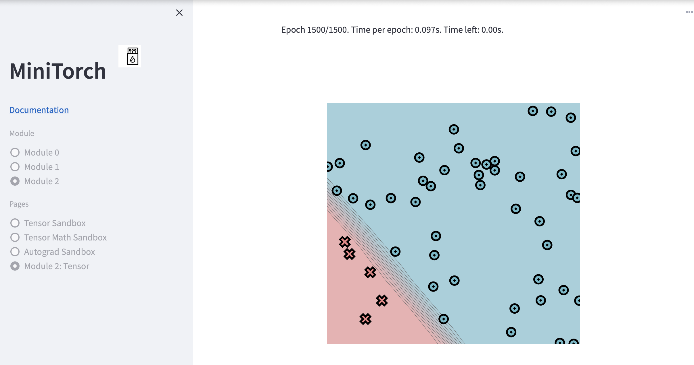

[](https://classroom.github.com/a/YFgwt0yY)
# MiniTorch Module 2


* Docs: https://minitorch.github.io/

* Overview: https://minitorch.github.io/module2/module2/

This assignment requires the following files from the previous assignments. You can get these by running

```bash
python sync_previous_module.py previous-module-dir current-module-dir
```

The files that will be synced are:

        minitorch/operators.py minitorch/module.py minitorch/autodiff.py minitorch/scalar.py minitorch/scalar_functions.py minitorch/module.py project/run_manual.py project/run_scalar.py project/datasets.py

# Training Results
## Simple Dataset
### Hyperparameters
    POINTS = 50
    HIDDEN LAYER = 2
    LEARNING RATE = 0.05
    EPOCH = 1000
### Training Logs


### Final Images


## Diag Dataset

### Hyperparameters
    POINTS = 50
    HIDDEN LAYER = 5
    LEARNING RATE = 0.05
    EPOCH = 1500
### Training Logs

### Final Images


## Split Dataset

### Hyperparameters
    POINTS = 50
    HIDDEN LAYER = 10
    LEARNING RATE = 0.05
    EPOCH = 1000

### Training Logs

### Final Images


## Split Dataset

### Hyperparameters
    POINTS = 50
    HIDDEN LAYER = 30
    LEARNING RATE = 0.05
    EPOCH = 1000

### Training Logs

### Final Images
